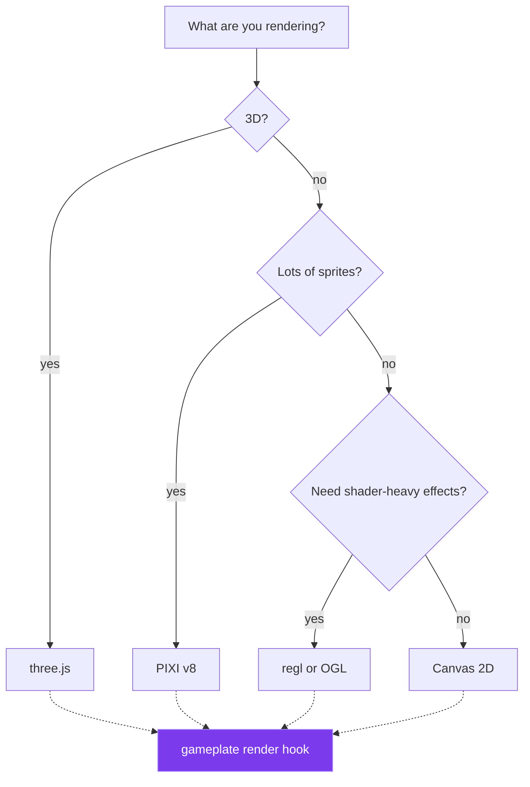

# WebGL, WebGPU & the GPU stack 🚀

`gameplate` is **renderer-agnostic** by design. It hands you state once per frame and an
optional interpolation `alpha`; what happens between `render(state, alpha)` and the pixel is
entirely up to you and your renderer of choice.

This guide shows the integration patterns for the most popular renderers in 2026 — each one is
a drop-in replacement, no changes to your game logic.

## The integration shape

Every pattern below boils down to:

1. **Initialize the renderer once**, before `createGame`.
2. **Update GPU resources from state inside `render`** — sync sprites' positions, push uniforms,
   etc. **Do not allocate on every frame.**
3. **Let the renderer draw**, either by calling its `draw()` directly or letting it tick on its
   own (e.g. PIXI's internal ticker; just pass it the same `state`).

```ts
import { createGame } from 'gameplate';

const renderer = await initMyRenderer(); // PIXI app / three.js scene / regl / etc.

const game = createGame({
  state,
  actions,
  render: (state, alpha) => {
    // sync state -> renderer
    renderer.draw(state, alpha);
  },
});

game.start();
```

That's the whole API surface for "use any GPU library." The rest of this guide is just the
specific renderer-side code for each library.

## three.js {#threejs}

```ts
import { createGame, defineActions } from 'gameplate';
import * as THREE from 'three';

const scene = new THREE.Scene();
const camera = new THREE.PerspectiveCamera(60, innerWidth / innerHeight, 0.1, 100);
camera.position.z = 5;

const renderer = new THREE.WebGLRenderer({ antialias: true });
renderer.setSize(innerWidth, innerHeight);
document.body.append(renderer.domElement);

const cube = new THREE.Mesh(
  new THREE.BoxGeometry(1, 1, 1),
  new THREE.MeshStandardMaterial({ color: 0xa78bfa }),
);
scene.add(cube);
scene.add(new THREE.AmbientLight(0xffffff, 0.6));
scene.add(new THREE.DirectionalLight(0xff5277, 0.8).translateX(5).translateY(5));

type State = { rotation: number };

const actions = defineActions<State>()({
  spin: (s, dt: number) => ({ rotation: s.rotation + dt }),
});

const game = createGame({
  state: { rotation: 0 },
  actions,
  fixedStep: 1 / 60,
  fixedUpdate: (s, dt, actions) => actions.spin(dt),
  render: (state, alpha) => {
    // interpolate between physics frames
    cube.rotation.x = state.rotation + alpha / 60;
    cube.rotation.y = state.rotation * 0.7 + alpha / 60;
    renderer.render(scene, camera);
  },
});

game.start();
```

**Why this works.** Three's `WebGLRenderer.render()` is the cheapest possible single draw
call. State changes happen in `actions` (deterministic); GPU sync happens in `render`. The
fixed-step accumulator + `alpha` gives buttery 144 Hz visuals on top of a 60 Hz simulation.

## PIXI.js v8 {#pixijs}

PIXI v8 ships with WebGPU support. Switch your renderer with one constant.

```ts
import { createGame, defineActions } from 'gameplate';
import * as PIXI from 'pixi.js';

const app = new PIXI.Application();
await app.init({
  preference: 'webgpu', // ✨ 2026: WebGPU by default; fallback to WebGL2
  resizeTo: window,
  background: '#0b0a14',
  antialias: true,
});
document.body.append(app.canvas);

const sprite = new PIXI.Graphics().rect(-12, -12, 24, 24).fill({ color: 0xa78bfa });
app.stage.addChild(sprite);

type State = { x: number; y: number; vx: number; vy: number };

const actions = defineActions<State>()({
  physics: (s, dt: number) => ({
    ...s,
    x: s.x + s.vx * dt,
    y: s.y + s.vy * dt,
    vy: s.vy + 200 * dt,
  }),
});

const game = createGame({
  state: { x: 100, y: 100, vx: 80, vy: 0 },
  actions,
  fixedStep: 1 / 60,
  fixedUpdate: (s, dt, actions) => actions.physics(dt),
  render: (state) => {
    sprite.x = state.x;
    sprite.y = state.y;
  },
});

game.start();
// PIXI ticks its own renderer internally — we just sync the scene graph from state.
```

**Pro tip.** Disable PIXI's own `Application.ticker` if you'd rather call `app.renderer.render`
yourself from inside `render(state)`:

```ts
await app.init({ ..., autoStart: false });
// ...
render: (state) => {
  sprite.x = state.x; sprite.y = state.y;
  app.renderer.render(app.stage);
},
```

That gives you a single deterministic loop with no double tick.

## regl {#regl}

Functional WebGL. State goes in via uniforms / attributes; commands return draw fns. This pairs
beautifully with `gameplate`'s pure-state model:

```ts
import { createGame, defineActions } from 'gameplate';
import REGL from 'regl';

const regl = REGL();
const drawTriangle = regl({
  vert: `
    precision mediump float;
    attribute vec2 position;
    uniform float t;
    void main() {
      gl_Position = vec4(position * (0.6 + 0.2 * sin(t)), 0.0, 1.0);
    }`,
  frag: `
    precision mediump float;
    uniform float t;
    void main() {
      gl_FragColor = vec4(vec3(0.65, 0.35, 0.92) + 0.2 * sin(t), 1.0);
    }`,
  attributes: {
    position: [
      [-1, -1],
      [1, -1],
      [0, 1],
    ],
  },
  uniforms: { t: regl.prop('t') },
  count: 3,
});

const game = createGame({
  state: { t: 0 },
  actions: defineActions<{ t: number }>()({
    tick: (s, dt: number) => ({ t: s.t + dt }),
  }),
  fixedStep: 1 / 60,
  fixedUpdate: (s, dt, actions) => actions.tick(dt),
  render: (state) => {
    regl.clear({ color: [0.04, 0.04, 0.08, 1] });
    drawTriangle({ t: state.t });
  },
});

game.start();
```

## OGL {#ogl}

Tiny WebGL2 framework, ~10 KB. Great fit for the `gameplate` philosophy.

```ts
import { createGame } from 'gameplate';
import { Renderer, Camera, Geometry, Program, Mesh } from 'ogl';

const renderer = new Renderer({ dpr: 2 });
const gl = renderer.gl;
document.body.append(gl.canvas);

const camera = new Camera(gl, { fov: 35 });
camera.position.set(0, 0, 6);

const geometry = new Geometry(gl, {
  position: { size: 3, data: new Float32Array([-1, -1, 0, 1, -1, 0, 0, 1, 0]) },
});

const program = new Program(gl, {
  vertex: `attribute vec3 position; uniform mat4 modelViewMatrix, projectionMatrix; void main() { gl_Position = projectionMatrix * modelViewMatrix * vec4(position, 1.0); }`,
  fragment: `precision highp float; void main() { gl_FragColor = vec4(0.65, 0.35, 0.92, 1.0); }`,
});

const mesh = new Mesh(gl, { geometry, program });

const game = createGame({
  state: { t: 0 },
  actions: { tick: (s, dt: number) => ({ t: s.t + dt }) } as const,
  update: (s, dt, actions) => actions.tick(dt),
  render: (state) => {
    mesh.rotation.y = state.t;
    renderer.render({ scene: mesh, camera });
  },
});

game.start();
```

## WebGPU (raw) {#webgpu}

You don't need a framework — just bring your pipeline.

```ts
import { createGame } from 'gameplate';

const adapter = await navigator.gpu.requestAdapter();
const device = await adapter!.requestDevice();
const canvas = document.querySelector<HTMLCanvasElement>('#stage')!;
const context = canvas.getContext('webgpu')!;
const format = navigator.gpu.getPreferredCanvasFormat();
context.configure({ device, format, alphaMode: 'premultiplied' });

// (build your pipeline / vertex buffer / uniform buffer here — beyond the scope of this snippet)
const pipeline: GPURenderPipeline = await buildPipeline(device, format);

const game = createGame({
  state: { t: 0 },
  actions: { tick: (s, dt: number) => ({ t: s.t + dt }) } as const,
  update: (s, dt, a) => a.tick(dt),
  render: (state) => {
    const encoder = device.createCommandEncoder();
    const view = context.getCurrentTexture().createView();
    const pass = encoder.beginRenderPass({
      colorAttachments: [
        {
          view,
          clearValue: { r: 0.04, g: 0.04, b: 0.08, a: 1 },
          loadOp: 'clear',
          storeOp: 'store',
        },
      ],
    });
    pass.setPipeline(pipeline);
    pass.draw(3);
    pass.end();
    device.queue.submit([encoder.finish()]);
  },
});

game.start();
```

WebGPU is the future. `gameplate` doesn't see GPU contexts at all — it'll never become
obsolete when WebGL2 sunsets.

## Canvas 2D {#canvas-2d}

For when you don't need a GPU at all:

```ts
import { createGame } from 'gameplate';

const ctx = (document.querySelector('canvas') as HTMLCanvasElement).getContext('2d')!;

const game = createGame({
  state,
  actions,
  render: (state) => {
    ctx.fillStyle = '#0b0a14';
    ctx.fillRect(0, 0, 800, 360);
    ctx.fillStyle = '#a78bfa';
    ctx.fillRect(state.x, state.y, 24, 24);
  },
});
game.start();
```

Sometimes the simplest answer is the right one. You can ship Pong with this and never touch a
shader.

## Picking a renderer



You can always swap later — your `state` / `actions` don't change.

## Avoiding allocation in `render`

The single biggest performance trap with any renderer is allocating objects inside the
render callback. `gameplate` calls `render` 60–144 times per second; every `{ ... }` in there
is a GC pause waiting to happen.

✅ **Do** mutate existing GPU/scene-graph nodes from state:

```ts
render: (state) => {
  sprite.x = state.x; // mutating a long-lived sprite is fine
  sprite.y = state.y;
};
```

❌ **Don't** allocate new objects, vectors, or arrays in `render`:

```ts
render: (state) => {
  sprite.position = { x: state.x, y: state.y }; // allocates every frame
  sprite.colors = state.enemies.map((e) => e.color); // allocates every frame
};
```

This rule applies in _every_ renderer above. `gameplate`'s `state` is immutable so you stay
honest there; the renderer's scene graph is mutable on purpose, so use it.

## Bonus: hot-swap renderers in development

Because the `render` callback is just a function, you can swap implementations at runtime:

```ts
let activeRender = renderWithThree;

const game = createGame({
  state,
  actions,
  render: (state, alpha) => activeRender(state, alpha),
});

if (import.meta.env.DEV) {
  window.addEventListener('keydown', (e) => {
    if (e.key === 'r' && e.altKey) {
      activeRender = activeRender === renderWithThree ? renderWithPixi : renderWithThree;
    }
  });
}
```

A/B test renderers, fall back when WebGPU isn't available, hot-swap during a demo. The game
loop doesn't notice.
