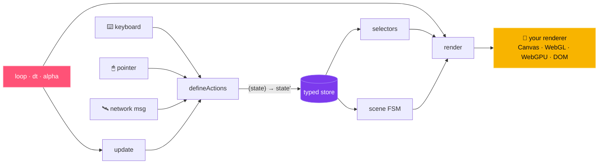

# What is `gameplate`?

> The **tiny TypeScript game framework**. Zero deps. Any renderer.

```ts
import { createGame, defineActions } from 'gameplate';

const actions = defineActions<{ x: number }>()({
  moveBy: (s, dx: number) => ({ x: s.x + dx }),
});

const game = createGame({
  state: { x: 0 },
  actions,
  update: (state, dt, actions) => actions.moveBy(60 * dt),
  render: (state) => draw(state),
});

game.start();
```

That's the API. Read it, write it, ship it.

## What you get

A handful of composable primitives. Pick what you need, ignore the rest.



Each arrow is a function call — not a framework hook. Replace any node with your own
implementation and the rest keeps working.

## Why people use it

- 🪶 **~4 KB gzipped, tree-shakeable.** Import only what you use; zero runtime deps.
- 🦺 **TypeScript-first.** Strict mode, perfect inference, no `as any`.
- 🎯 **Renderer-agnostic.** Bring Canvas, WebGL, WebGPU, PIXI, Three.js — anything.
- ⏱️ **Deterministic loop.** Variable or fixed-step with interpolation.
- 🎲 **Seeded RNG + game-time timers.** Reproducible randomness; `after`/`every` that respect pause.
- 🎮 **Headless-ready.** Same code runs in the browser AND in Node.
- 🎞️ **Record & replay.** Capture every action; replay deterministically.

## Get started in 60 seconds

👉 **[Install →](./getting-started/installation.md)**
👉 **[Quickstart →](./getting-started/quickstart.md)** (one complete game in 30 lines)
👉 **[Why gameplate? →](./getting-started/why-gameplate.md)** (vs. PIXI / Three / XState)

Or browse the guides:

- 🗂️ [State & Actions](./guides/state-and-actions.md) — the typing magic behind `defineActions`
- ⏱️ [Game Loop](./guides/loop.md) — when to use fixed-step
- 🎮 [Input](./guides/input.md) — keyboard + pointer + gamepad, normalized
- 🎬 [Scenes (FSM)](./guides/scenes.md) — menus, modes, game-over
- 🧠 [Selectors](./guides/selectors.md) — memoized derived state
- 🎲 [Random](./guides/random.md) — seeded, reproducible, serializable RNG
- ⏲️ [Timers](./guides/timers.md) — game-time `after` / `every` scheduling
- 🎞️ [Recording & Replay](./guides/recording.md) — deterministic record + replay of every action
- 🖥️ [Headless / Node](./guides/headless.md) — same game, no DOM
- 🚀 [WebGL & GPU](./guides/webgl.md) — Three, PIXI v8, WebGPU patterns
